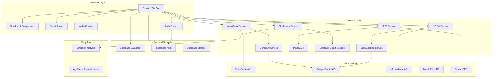
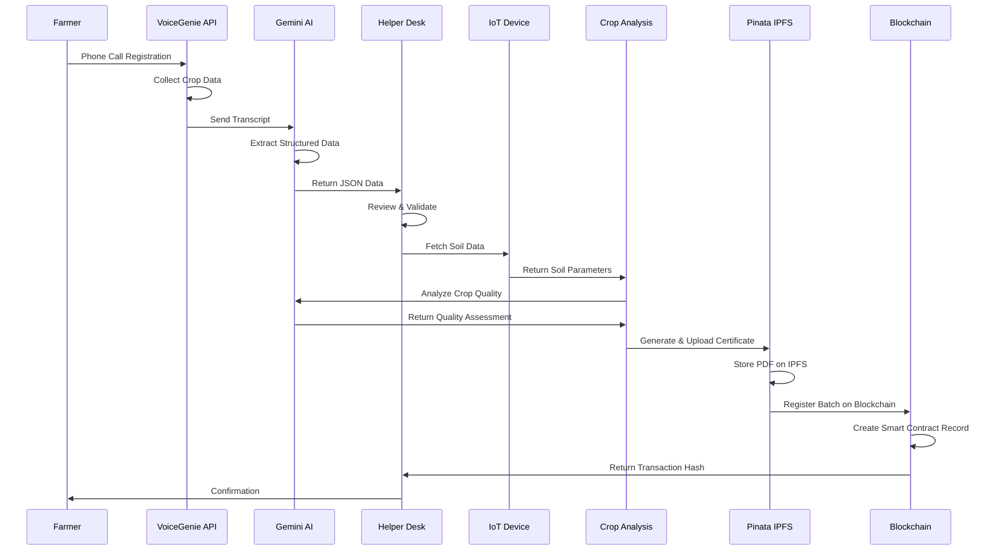
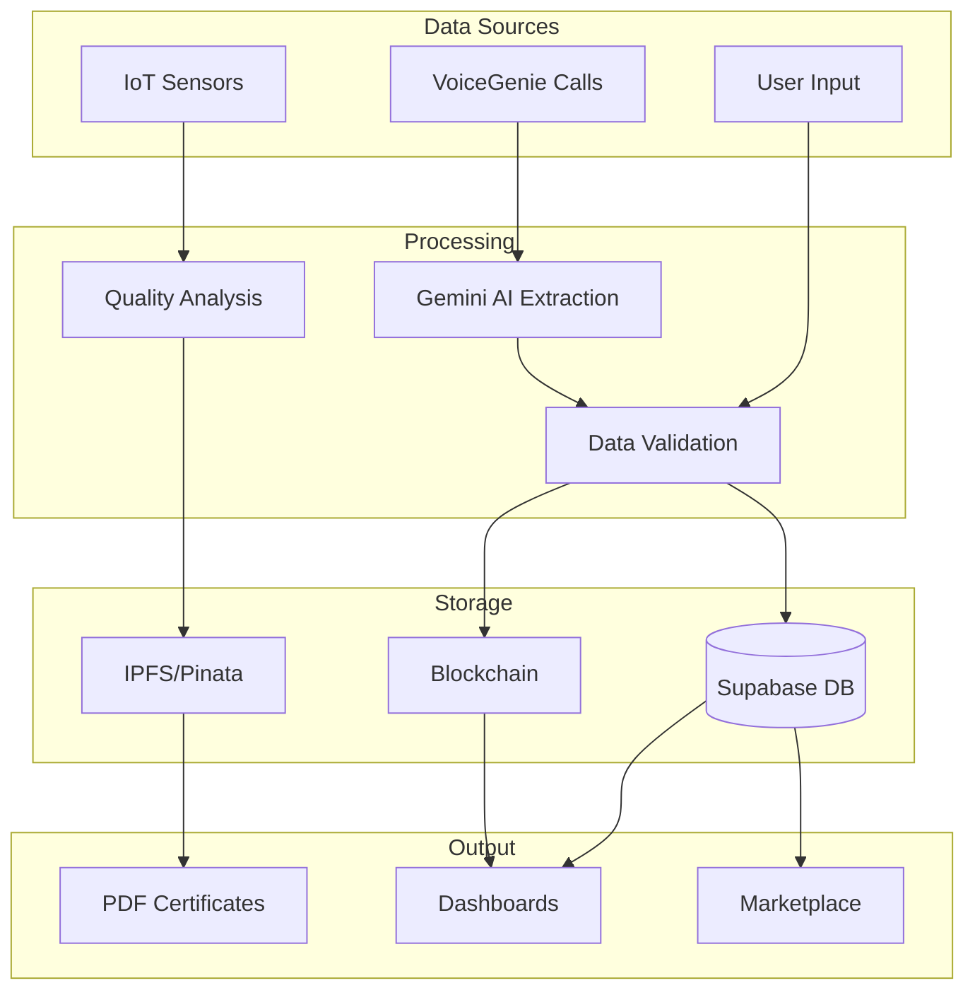
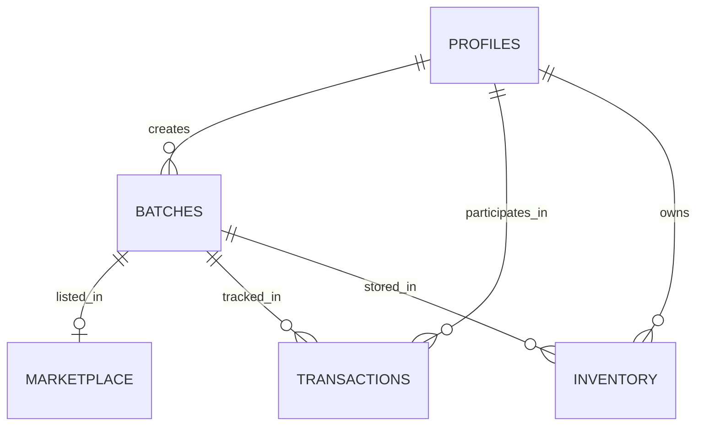

# 🌾 AgriTrace - Agricultural Supply Chain Transparency Platform

<div align="center">


**A revolutionary blockchain-powered platform ensuring complete transparency and traceability in agricultural supply chains from farm to table.**

[Features](#-key-features) • [Architecture](#-architecture) • [Setup](#-getting-started) • [Documentation](#-documentation) • [Contributing](#-contributing)

</div>

---

## 📋 Table of Contents

- [Overview](#-overview)
- [Key Features](#-key-features)
- [Architecture](#️-architecture)
- [Tech Stack](#️-tech-stack)
- [Getting Started](#-getting-started)
- [User Roles & Workflows](#-user-roles--workflows)
- [API Integrations](#-api-integrations)
- [Database Schema](#️-database-schema)
- [Scalability & Infrastructure](#-scalability--infrastructure)
- [Deployment](#-deployment)
- [Research & Market Analysis](#-research--market-analysis)
- [Business Viability & Revenue Model](#-business-viability--revenue-model)
- [Team Contributions](#-team-contributions)


---

## 🎯 Overview

AgriTrace is a comprehensive agricultural supply chain management platform developed for the ****. It leverages cutting-edge technologies including **blockchain**, **AI-powered quality analysis**, and **IoT integration** to ensure complete transparency, traceability, and fair pricing throughout the agricultural supply chain.


### Mission

To empower farmers across Odisha with modern technology that provides:
- ✅ Complete transparency in the agricultural supply chain
- ✅ Fair pricing through market data integration
- ✅ Consumer trust through verifiable blockchain certificates
- ✅ Food security through quality assurance
- ✅ Accessibility for farmers without internet via voice-based registration

---

## ✨ Key Features

### 🔐 Authentication & Authorization
- **Multi-role access control**: Farmer, Distributor, Retailer, Admin
- **Web3 wallet integration**: MetaMask and other Ethereum wallets
- **Secure authentication**: Supabase Auth with JWT tokens
- **Role-based dashboard**: Customized views for each user type

### 📦 Batch Registration
- **Voice-based registration**: Phone call registration via VoiceGenie API for farmers without internet
- **AI-powered data extraction**: Google Gemini AI extracts structured data from conversation transcripts
- **IoT soil data integration**: Real-time soil quality analysis from hardware sensors
- **Crop quality assessment**: AI-powered analysis using Gemini 2.5 Flash
- **PDF certificate generation**: Automated harvest certificates with QR codes
- **IPFS storage**: Immutable certificate storage on Pinata IPFS
- **Blockchain registration**: Ethereum smart contract integration for permanent records

### 🛒 Marketplace System
- **Multi-tier marketplace**: Separate marketplaces for farmers, distributors, and retailers
- **Real-time price suggestions**: Integration with mandi price APIs
- **Inventory management**: Track batches through supply chain stages
- **Purchase transactions**: Blockchain-verified ownership transfers
- **QR code scanning**: Quick product verification and tracking

### 📊 Supply Chain Tracking
- **End-to-end traceability**: Track products from farm to consumer
- **Transaction history**: Complete blockchain transaction records
- **Certificate verification**: Verify authenticity of harvest certificates
- **Supply chain visualization**: Visual representation of product journey

### 🤖 AI & IoT Integration
- **VoiceGenie integration**: Voice-based batch registration for offline farmers
- **Google Gemini AI**: Transcript analysis and crop quality assessment
- **IoT soil sensors**: Real-time soil data (temperature, humidity, moisture, pH, NPK levels)
- **Crop health analysis**: AI-powered quality assessment based on soil data

### 🎨 Modern UI/UX
- **Responsive design**: Mobile-first approach with Tailwind CSS
- **Shadcn UI components**: Beautiful, accessible component library
- **Dark mode support**: Theme switching capability
- **Real-time updates**: Live data synchronization

---

## 🏗️ Architecture

### System Architecture Overview




### Batch Registration Flow



### Supply Chain Flow

```mermaid
graph LR
    A[Farmer<br/>Registers Batch] --> B[Generate<br/>Certificate]
    B --> C[Upload to<br/>IPFS]
    C --> D[Register on<br/>Blockchain]
    D --> E[Farmer<br/>Marketplace]
    E --> F[Distributor<br/>Purchases]
    F --> G[Update<br/>Ownership]
    G --> H[Distributor<br/>Inventory]
    H --> I[Distributor<br/>Marketplace]
    I --> J[Retailer<br/>Purchases]
    J --> K[Update<br/>Ownership]
    K --> L[Retailer<br/>Inventory]
    L --> M[End Consumer]
    
    style A fill:#90EE90
    style F fill:#87CEEB
    style J fill:#DDA0DD
    style M fill:#FFB6C1
```



### Data Flow Architecture



---

## 🛠️ Tech Stack

### Frontend
- **Framework**: React 18.3 with TypeScript
- **Build Tool**: Vite 5.4
- **UI Library**: Shadcn UI (Radix UI primitives)
- **Styling**: Tailwind CSS 3.4
- **Routing**: React Router DOM 6.30
- **State Management**: React Context API + TanStack Query
- **Forms**: React Hook Form + Zod validation
- **Charts**: Recharts 2.15
- **PDF Generation**: jsPDF 3.0
- **QR Codes**: qrcode 1.5

### Blockchain
- **Network**: Ethereum
- **Library**: Ethers.js 6.15
- **Smart Contracts**: Solidity 0.8.20
- **Contract Framework**: OpenZeppelin Contracts

### Backend & Database
- **Database**: Supabase (PostgreSQL)
- **Authentication**: Supabase Auth
- **Storage**: Supabase Storage + Pinata IPFS
- **API**: RESTful APIs

### AI & External Services
- **AI Service**: Google Gemini 2.5 Flash API
- **Voice Service**: VoiceGenie API
- **IoT Integration**: Hardware API (REST)
- **Price Data**: Mandi Price APIs
- **IPFS**: Pinata IPFS Service

### Development Tools
- **Language**: TypeScript 5.8
- **Linting**: ESLint 9.32
- **Package Manager**: npm
- **Version Control**: Git

## 🛠️Infrastructure

AgriTrace is built on a modular, high-performance architecture designed for scalability, security, and low-latency interaction.

### 🖥️ Frontend Ecosystem
- **Core Framework**: React 18.3 with TypeScript 5.8 - Ensures type safety and component reusability.
- **Build System**: Vite 5.4 - Utilizing SWC for lightning-fast HMR and optimized production builds.
- **UI/UX Library**: Shadcn UI (built on Radix UI) - Accessible, headless components for a robust design system.
- **Styling Engine**: Tailwind CSS 3.4 - Utility-first CSS for rapid, responsive UI development.
- **State Management & Data Fetching**: TanStack Query v5 - Handles server state, caching, and background updates efficiently.
- **Form Management**: React Hook Form + Zod - Performant, schema-based validation.
- **Visualization**: Recharts 2.15 - Responsive, composable charting library for data analytics.

### ⛓️ Blockchain & Web3 Layer
- **Smart Contracts**: Solidity 0.8.20 - Secure contract logic with reentrancy protection.
- **Standards**: OpenZeppelin Contracts - Industry-standard security patterns (AccessControl, ReentrancyGuard).
- **Interaction Library**: Ethers.js 6.15 - Lightweight, complete Ethereum wallet implementation and contract interaction.
- **Network**: Polygon PoS (Planned Mainnet) / Sepolia (Testnet) - Chosen for high throughput and low transaction costs.

### ☁️ Backend & Cloud Infrastructure
- **BaaS (Backend-as-a-Service)**: Supabase - Provides:
  - **Database**: PostgreSQL with Row Level Security (RLS) for granular access control.
  - **Auth**: Secure JWT-based authentication linked to Web3 wallets.
  - **Storage**: Object storage for non-critical media.
- **Decentralized Storage**: Pinata IPFS - Immutable, distributed storage for harvest certificates and critical proofs.
- **API Layer**: RESTful Microservices Architecture.

### 🤖 AI & IoT Intelligence
- **Generative AI**: Google Gemini 2.5 Flash API - Low-latency multimodal model for structuring voice data and analyzing crop health images.
- **Voice Processing**: VoiceGenie API - Specialized telephony integration for handling concurrent farmer calls.
- **IoT Connectivity**: ESP32/Arduino REST API - Lightweight endpoints for ingesting real-time soil telemetry (NPK, pH, Moisture).

### 🚀 DevOps, Scalability & Deployment
- **Containerization**: Docker - Ensures consistent environments across development, testing, and production microservices.
- **Orchestration**: Kubernetes (K8s) - Manages container scaling, specifically for the AI Inference and Voice Handling nodes during high-traffic harvest seasons.
- **CI/CD Pipeline**: GitHub Actions - Automated testing, linting (ESLint 9.32), and deployment workflows.
- **Code Quality**: ESLint + Prettier - Enforces strict coding standards and consistent formatting.
- **Production Hosting**:
  - **Frontend**: Vercel/Netlify (Edge Network).
  - **Services**: AWS EKS / Google GKE.

---

## 👥 User Roles & Workflows

### 🌾 Farmer

**Capabilities:**
- Register new crop batches via web form or phone call
- View registered batches and certificates
- Access farmer marketplace (view only, cannot purchase)
- Track batch status and ownership transfers
- View market price suggestions

**Registration Flow:**
1. Connect Web3 wallet (MetaMask)
2. Fill batch registration form or call VoiceGenie
3. System fetches IoT soil data automatically
4. AI analyzes crop quality based on soil parameters
5. PDF certificate generated with QR code
6. Certificate uploaded to IPFS
7. Batch registered on blockchain
8. Farmer receives confirmation

### 🏪 Distributor

**Capabilities:**
- Purchase batches from farmer marketplace
- Manage distributor inventory
- Sell batches to retailers via distributor marketplace
- View transaction history
- Track supply chain

**Purchase Flow:**
1. Browse farmer marketplace
2. Select batch and review certificate
3. Initiate purchase transaction
4. Approve blockchain transaction
5. Ownership transferred on-chain
6. Batch added to distributor inventory

### 🛒 Retailer

**Capabilities:**
- Purchase batches from distributor marketplace
- Manage retailer inventory
- View product details and certificates
- Track supply chain history
- QR code scanning for verification

**Purchase Flow:**
1. Browse distributor marketplace
2. Select batch and verify certificate
3. Complete purchase transaction
4. Ownership transferred
5. Batch added to retailer inventory

### 👨‍💼 Admin

**Capabilities:**
- Access Helper Desk for voice registration review
- Approve/reject batch registrations from phone calls
- View system analytics
- Manage user roles
- Monitor system health

**Helper Desk Workflow:**
1. View pending voice registrations
2. Review extracted data and confidence scores
3. Validate information completeness
4. Approve or request corrections
5. System processes approved registrations

---

## 🔌 API Integrations

### VoiceGenie API
- **Purpose**: Voice-based batch registration for farmers without internet
- **Endpoint**: `https://voiceagent-6h5b.onrender.com/api/calls`
- **Method**: GET
- **Authentication**: API Key
- **Response**: Call transcripts, conversation data, metadata

### Google Gemini API
- **Purpose**: 
  - Extract structured data from voice transcripts
  - Analyze crop quality based on soil data
- **Model**: `gemini-2.5-flash`
- **Endpoint**: `https://generativelanguage.googleapis.com/v1beta/models/gemini-2.5-flash:generateContent`
- **Authentication**: API Key
- **Features**:
  - Natural language understanding
  - JSON structured output
  - Multi-language support (Hindi, Odia, Telugu, English)

### IoT Hardware API
- **Purpose**: Fetch real-time soil sensor data
- **Endpoint**: `https://hardwareapi-4xbs.onrender.com/latest`
- **Method**: GET
- **Data Points**:
  - Temperature
  - Humidity
  - Soil Moisture
  - pH Level
  - NPK Levels (Nitrogen, Phosphorus, Potassium)
  - Light (LDR)
  - Gas levels
  - Rain detection

### Pinata IPFS
- **Purpose**: Store harvest certificates immutably
- **Service**: Pinata IPFS
- **Features**:
  - Group-based file organization
  - JWT authentication
  - Metadata storage
  - Direct IPFS gateway access

### Mandi Price API
- **Purpose**: Provide market price suggestions
- **Integration**: Multiple mandi price APIs
- **Data**: Real-time crop prices by location

---

## 🗄️ Database Schema

### Core Tables

#### `profiles`
- User profile information
- Role-based access (farmer, distributor, retailer, admin)
- Wallet address linkage

#### `batches`
- Crop batch registration data
- Links to IPFS certificates
- Blockchain transaction hashes
- Crop analysis data (JSONB)
- Soil data (JSONB)

#### `marketplace`
- Available batches for sale
- Pricing information
- Availability status
- Owner information

#### `transactions`
- Supply chain transaction records
- Buyer/seller information
- Blockchain transaction hashes
- Timestamps

#### `inventory` (Distributor/Retailer)
- Current inventory holdings
- Batch ownership
- Quantity tracking

### Key Relationships


## 🚀 Scalability & Infrastructure

AgriTrace is built as a **fully modularized microservices architecture**, allowing each component to scale independently based on load.

### 🏗️ Microservices Architecture
* **Auth Service:** Handles JWT & Wallet authentication (Stateless).
* **Ingestion Service:** Processes high-velocity IoT data streams via MQTT.
* **AI Inference Node:** Dedicated isolated environments for running heavy ML models.
* **Blockchain Listener:** Event-driven service that syncs on-chain data to our off-chain SQL database for rapid querying.

### 🌐 Hosting & Deployment Strategy

#### 1. Backend & API Services (Containerized)
We use **Docker** to containerize all services, orchestrated via **Kubernetes (K8s)** for auto-scaling.
* **Hosting:** AWS EKS / Google GKE (scalable clusters).
* **Load Balancing:** NGINX Ingress controller to route traffic between the Voice Agent and Dashboard.

#### 2. Local "Edge" AI Deployment (Privacy & Speed)
Unlike traditional cloud-dependent architectures, we deploy our AI models **locally** on edge servers or private clusters to ensure data privacy and zero-latency processing.
* **Crop Disease Models:** Deployed on edge devices using **TensorFlow Lite**.
* **LLM (Gemini):** We utilize **Local Inference Nodes** running optimized, distilled versions of Large Language Models (including **Gemini Nano** or quantized variants) directly on our secure infrastructure. This ensures:
    * **Zero Data Leakage:** Farmer voice data never leaves our secure perimeter.
    * **Offline Capability:** Critical analysis can happen even with intermittent internet connectivity.

#### 3. Blockchain (Layer 2)
* **Network:** Polygon (chosen for high throughput of ~65,000 TPS and negligible gas fees).
* **Storage:** We utilize **IPFS (Pinata)** for decentralized file storage, keeping the ledger lightweight.

---

## 🚢 Deployment

### Environment Setup

1. **Set production environment variables**
   ```env
   VITE_SUPABASE_URL=production_url
   VITE_SUPABASE_ANON_KEY=production_key
   VITE_GEMINI_API_KEY=production_key
   VITE_CONTRACT_ADDRESS=mainnet_contract_address
   VITE_NETWORK=mainnet
   ```

2. **Build the application**
   ```bash
   npm run build
   ```

3. **Deploy to hosting platform**
   - **Vercel**: Connect GitHub repo, auto-deploy
   - **Netlify**: Drag & drop `dist` folder
   - **AWS S3 + CloudFront**: Upload `dist` to S3 bucket
   - **GitHub Pages**: Use GitHub Actions

### Smart Contract Deployment

1. **Compile contract**
   ```bash
   npx hardhat compile
   ```

2. **Deploy to network**
   ```bash
   npx hardhat run scripts/deploy.js --network mainnet
   ```

3. **Update contract address** in `.env`

### Database Migration

Run Supabase migrations in production:
1. Connect to production Supabase project
2. Run SQL scripts in order
3. Verify schema matches development

---

## 📚 Documentation

### Additional Documentation Files

- **[ENV_SETUP.md](./ENV_SETUP.md)**: Detailed environment variable setup
- **[OMNIDIM_INTEGRATION_ROADMAP.md](./OMNIDIM_INTEGRATION_ROADMAP.md)**: Voice integration roadmap
- **[COMPLETE_SUPPLY_CHAIN_FLOW.md](./COMPLETE_SUPPLY_CHAIN_FLOW.md)**: Supply chain flow details

### Key Service Files

- `src/services/geminiService.ts`: AI data extraction
- `src/services/voicegenieService.ts`: Voice call integration
- `src/services/iotSoilDataService.ts`: IoT data fetching
- `src/services/cropAnalysisService.ts`: Crop quality analysis
- `src/utils/singleStepGroupManager.ts`: IPFS certificate management
- `src/utils/blockchainTransactionManager.ts`: Blockchain interactions

---
## 🔬 Research & Market Analysis

Our architecture is not just theoretical; it is a **second-generation Agritech solution** designed by analyzing the specific failure points of first-generation startups like **ReshaMandi**, **Ninjacart**, and **Intello Labs**. We have identified *why* they struggled and built **AgriTrace** as a "modified better version" that solves these structural issues.

| Failure Point (Industry Analysis) | The AgriTrace Solution |
| :--- | :--- |
| **1. The Logistics Trap** (Ref: *ReshaMandi, Ninjacart*)<br>First-gen startups adopted an **"Asset-Heavy" model**, owning trucks and warehouses. This led to massive cash burn where logistics costs consumed 30-40% of revenue, making unit economics unsustainable. | **Algorithmic Truck Pooling**<br>Instead of buying trucks, our system detects **"Empty Return Trips"** of existing logistics providers. By matching farmers with trucks that are *already* returning empty from urban centers, we slash transport costs by **~40%**. This is a modified asset-light version that prioritizes utilization over ownership. |
| **2. The Credit Crisis** (Ref: *Groc, AgNext*)<br>Startups often failed because they tried to eliminate middlemen (Arhatiyas) without replacing the **credit/financing** they provided. Farmers went back to middlemen because they needed immediate working capital. | **Smart Contract Escrow & Milestone Payments**<br>We don't just facilitate payments; we automate trust. Buyers deposit funds into a blockchain Escrow. The system releases **partial working capital** to the farmer immediately upon verified harvest registration (via IoT/Voice). This replaces predatory lending with **asset-backed liquidity**. |
| **3. The "Tech-Tax" Barrier** (Ref: *Intello Labs, DeHaat*)<br>Solutions relying on complex apps or expensive grading hardware ($1000+ devices) faced poor adoption among marginal farmers (earning <₹10k/month). The "Digital Divide" killed scalability. | **VoiceGenie (AgroSathi) & Commodity IoT**<br>We removed the screen entirely. Farmers register batches via a simple phone call in their local dialect (Odia/Hindi). Coupled with **$10 ESP32 IoT sensors** (vs. expensive spectrometers), we lower the entry barrier by **90%**, making technology accessible to the poorest farmers. |
| **4. The Trust Deficit** (Ref: *E-Mandi Platforms*)<br>E-Mandis often fail because remote buyers don't trust the quality reported by farmers ("Grade A" on the app turns out to be "Grade C" on delivery). | **Multi-Modal Verification (AI + IoT)**<br>We introduce **"Proof of Quality"**. We don't rely on a single data point; we cross-verify **Visual Data** (Gemini AI analyzing crop photos) with **Environmental Data** (IoT Soil Sensors). This dual-validation is stamped on the Blockchain, creating an **Immutable Quality Certificate** buyers can trust blindly. 
---
## 💰 Business Viability & Revenue Model
AgriTrace is designed for long-term sustainability through diverse revenue streams:
* **Transaction Fees:** Small % on successful escrow releases (replacing high middleman commissions).
* **Premium Analytics:** Paid subscription for large Retailers/Distributors for advanced supply chain forecasting.
* **Institutional Data:** Monetizing anonymized regional crop health data for Insurance companies and Government agencies.
---
### 👥 Team Contributions

| Member | Role | Key Contributions |
| :--- | :--- | :--- |
| **Jarir Khan** | Full Stack & Blockchain | Developed the `AgriTrace.sol` smart contract, integrated Ethers.js, and built the React frontend architecture. |
| **Sahil Gawade** | Backend & Blockchain  |  Gemini AI prompt engineering for crop analysis, and backend API services. |
| **Yusuf Kondkari** | Ai Agents,Backend and Hardware | configured the IoT sensors (ESP32/Arduino) for real-time soil data (NPK, Moisture) ,Implemented `VoiceGenie` integration, developed the "Truck Pooling" logistics logic. |
| **Tauhid Khan** | Full Stack | UI and Module Integration |
### Code Style

- Follow TypeScript best practices
- Use ESLint for linting
- Write meaningful commit messages
- Add comments for complex logic
- Update documentation for new features

---

## 🙏 Acknowledgments

- **OpenZeppelin** for smart contract security patterns
- **Supabase** for backend infrastructure
- **Shadcn** for UI components
- **VoiceGenie** for voice integration
- **Google Gemini** for AI capabilities

---

<div align="center">

**Built with ❤️ for the farmers**

[GitHub](https://github.com/kjarir/AgriTrace)

</div>
